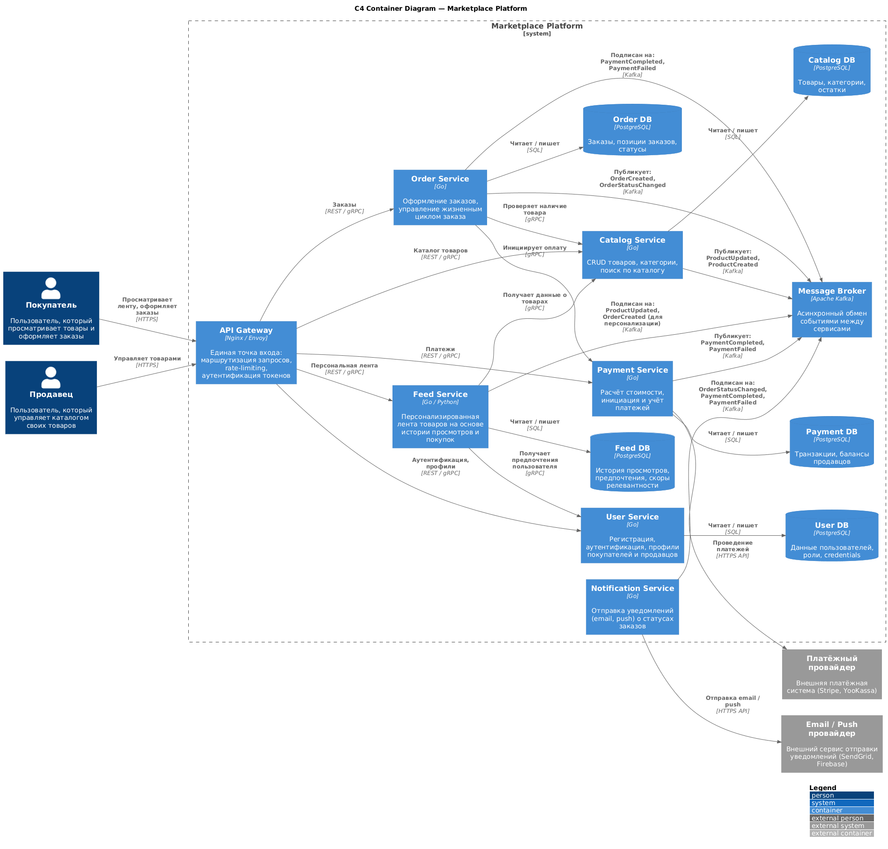

# Marketplace Platform — Архитектурное проектирование

## Оглавление

1. [Обзор системы](#1-обзор-системы)
2. [C4 Container диаграмма](#2-c4-container-диаграмма)
3. [Домены и зоны ответственности](#3-домены-и-зоны-ответственности)
4. [Распределение доменов по сервисам](#4-распределение-доменов-по-сервисам)
5. [Границы владения данными и взаимодействие сервисов](#5-границы-владения-данными-и-взаимодействие-сервисов)
6. [Альтернативные варианты декомпозиции](#6-альтернативные-варианты-декомпозиции)
7. [Trade-off'ы вариантов](#7-trade-offы-вариантов)
8. [Обоснование финального выбора](#8-обоснование-финального-выбора)
9. [Запуск проекта](#9-запуск-проекта)

---

## 1. Обзор системы

Маркетплейс — цифровая платформа, на которой **продавцы** размещают товары, а **покупатели** оформляют заказы. Система обеспечивает:

- Персонализированную выдачу ленты товаров
- Управление товарным каталогом (для продавцов)
- Управление пользователями (покупатели и продавцы)
- Оформление заказов
- Расчёт и учёт платежей
- Отправку уведомлений о статусах заказов

---

## 2. C4 Container диаграмма

Диаграмма находится в файле [`docs/c4-container.puml`](docs/c4-container.puml) (формат PlantUML).



Для пересоздания PNG из исходника:

```bash
docker run --rm -v "$(pwd)/docs:/data" plantuml/plantuml -tpng /data/c4-container.puml
```

---

## 3. Домены и зоны ответственности

В системе выделены **6 бизнес-доменов**:

| # | Домен | Зона ответственности |
|---|-------|---------------------|
| 1 | **Пользователи (Users)** | Регистрация, аутентификация (JWT), авторизация, управление профилями покупателей и продавцов, роли и права доступа |
| 2 | **Каталог (Catalog)** | CRUD товаров, управление категориями, поиск и фильтрация по каталогу, управление остатками, модерация карточек товаров |
| 3 | **Персонализированная лента (Feed)** | Формирование персонализированной ленты товаров для каждого покупателя. Персонализация на основе: истории просмотров, истории покупок, категорий интересов |
| 4 | **Заказы (Orders)** | Создание заказа, управление жизненным циклом (создан → оплачен → в доставке → завершён → отменён), хранение состава заказа |
| 5 | **Платежи (Payments)** | Расчёт итоговой стоимости, интеграция с внешним платёжным провайдером, учёт транзакций, управление балансами продавцов |
| 6 | **Уведомления (Notifications)** | Отправка уведомлений покупателям и продавцам о смене статусов заказов, об успешных/неуспешных платежах. Каналы: email, push |

---

## 4. Распределение доменов по сервисам

Каждый домен выделен в **отдельный микросервис** (1 домен = 1 сервис):

| Сервис | Домен | Обоснование выделения |
|--------|-------|-----------------------|
| **User Service** | Пользователи | Аутентификация — отдельный сервис, который позволяет независимо масштабировать и обновлять auth-логику, не затрагивая остальные сервисы |
| **Catalog Service** | Каталог | Высокая нагрузка на чтение (просмотр каталога); нужен независимый scaling. У продавцов и покупателей принципиально разные паттерны работы с каталогом |
| **Feed Service** | Лента | Вычислительно ёмкая персонализация; может использовать ML-модели; независимый цикл разработки |
| **Order Service** | Заказы | Заказ связывает покупателя, товары и платёж — это ключевой процесс маркетплейса. Выделение в отдельный сервис позволяет надёжно хранить данные о заказах и не зависеть от изменений в других сервисах |
| **Payment Service** | Платежи | Повышенные требования к безопасности и аудиту; интеграция с внешним провайдером; PCI DSS compliance требует изоляции |
| **Notification Service** | Уведомления | Полностью event-driven; не требует синхронного взаимодействия; может временно отставать (eventual consistency) без влияния на основной бизнес-процесс |

**Логика разбиения:** Декомпозиция выполнена по принципу **Bounded Context** (DDD). Каждый сервис инкапсулирует один домен и владеет своими данными. Границы проведены так, чтобы минимизировать синхронные межсервисные вызовы и максимизировать автономность команд разработки.

---

## 5. Границы владения данными и взаимодействие сервисов

### 5.1 Владение данными

Каждый сервис имеет **собственное хранилище** — shared database отсутствует.

| Сервис | Хранилище | Данные |
|--------|-----------|--------|
| **User Service** | PostgreSQL (`user_db`) | Пользователи (email, password hash, роль), профили, сессии |
| **Catalog Service** | PostgreSQL (`catalog_db`) | Товары (название, описание, цена, seller_id), категории, остатки |
| **Feed Service** | PostgreSQL (`feed_db`) | История просмотров, предпочтения пользователей, скоры релевантности |
| **Order Service** | PostgreSQL (`order_db`) | Заказы (buyer_id, статус, сумма), позиции заказа (product_id, количество, цена на момент заказа) |
| **Payment Service** | PostgreSQL (`payment_db`) | Транзакции (order_id, сумма, статус, provider_tx_id), балансы продавцов |
| **Notification Service** | — (stateless) | Не хранит данные; читает события из Kafka и отправляет уведомления |

> **Принцип:** Сервис, который *владеет* данными, является единственным, кто может их *изменять*. Остальные сервисы получают данные через API или события.

### 5.2 Взаимодействие сервисов

#### Синхронные вызовы (REST / gRPC)

| Кто вызывает | Кого вызывает | Что запрашивает | Протокол |
|-------------|--------------|-----------------|----------|
| API Gateway | User Service | Аутентификация, получение профиля | REST |
| API Gateway | Catalog Service | Список товаров, карточка товара | REST |
| API Gateway | Feed Service | Персональная лента | REST |
| API Gateway | Order Service | Создание/просмотр заказа | REST |
| API Gateway | Payment Service | Статус платежа | REST |
| Feed Service | Catalog Service | Данные о товарах для ленты | gRPC |
| Feed Service | User Service | Предпочтения пользователя | gRPC |
| Order Service | Catalog Service | Проверка наличия и актуальной цены | gRPC |
| Order Service | Payment Service | Инициация платежа | gRPC |
| Payment Service | Платёжный провайдер | Проведение оплаты | HTTPS |

#### Асинхронные события (Kafka)

| Продюсер | Событие | Консьюмеры |
|----------|---------|------------|
| Order Service | `OrderCreated` | Feed Service (обновление рекомендаций), Notification Service |
| Order Service | `OrderStatusChanged` | Notification Service |
| Payment Service | `PaymentCompleted` | Order Service (обновление статуса), Notification Service |
| Payment Service | `PaymentFailed` | Order Service, Notification Service |
| Catalog Service | `ProductCreated` | Feed Service (обновление индекса) |
| Catalog Service | `ProductUpdated` | Feed Service |

**Выбор синхронного vs асинхронного взаимодействия:**

- **Синхронное (gRPC/REST)** — когда результат нужен немедленно для обработки пользовательского запроса (например, проверка наличия товара при оформлении заказа).
- **Асинхронное (Kafka)** — когда допустима eventual consistency и важна надёжность доставки (например, уведомления, обновление рекомендательного индекса).

---

## 6. Альтернативные варианты декомпозиции

### Вариант A: Микросервисная архитектура (6 сервисов) — *выбранный*

Каждый домен = отдельный сервис со своим хранилищем.

```
[User Svc] [Catalog Svc] [Feed Svc] [Order Svc] [Payment Svc] [Notification Svc]
    │            │            │           │            │               │
  UserDB     CatalogDB     FeedDB     OrderDB     PaymentDB       (stateless)
```

### Вариант B: Модульный монолит (1 deployment unit)

Все домены в одном приложении, но разделены на модули с чёткими границами. Каждый модуль общается через internal API (интерфейсы). Единая БД, но с разделением на схемы (schemas).

```
┌─────────────────────────────────────────────┐
│              Marketplace Monolith            │
│  ┌──────┐ ┌───────┐ ┌────┐ ┌─────┐ ┌─────┐ │
│  │Users │ │Catalog│ │Feed│ │Order│ │Pay  │ │
│  └──────┘ └───────┘ └────┘ └─────┘ └─────┘ │
│                     │                        │
│              PostgreSQL (schemas)             │
└─────────────────────────────────────────────┘
```

### Вариант C: Гибридная архитектура (3 сервиса)

Объединение доменов по степени связности:

- **Core Service** — Users + Catalog + Orders (тесно связанные домены, формирующие ядро маркетплейса)
- **Payment Service** — отдельно из-за требований безопасности (PCI DSS)
- **Engagement Service** — Feed + Notifications (домены, ориентированные на вовлечение пользователей)

```
[Core Service]          [Payment Service]       [Engagement Service]
 Users + Catalog         Payments                Feed + Notifications
 + Orders
    │                        │                        │
  CoreDB                 PaymentDB                  Redis
```

---

## 7. Trade-off'ы вариантов

### Вариант A: Микросервисы (6 сервисов)

| Плюсы | Минусы |
|-------|--------|
| Независимое масштабирование каждого домена | Высокая операционная сложность (6 сервисов, 5 БД, Kafka) |
| Изолированные failure domains — сбой одного сервиса не роняет остальные | Сетевые задержки на межсервисных вызовах (latency) |
| Независимые циклы деплоя и разработки | Сложность обеспечения консистентности данных (distributed transactions) |
| Возможность использовать разные технологии для разных сервисов | Требует зрелой DevOps-культуры (CI/CD, мониторинг, tracing) |
| Чёткие границы владения — удобно для нескольких команд | Overhead на инфраструктуру (каждому сервису нужна своя БД, health checks, логирование) |

### Вариант B: Модульный монолит

| Плюсы | Минусы |
|-------|--------|
| Простота запуска и деплоя — один артефакт | Масштабируется только целиком (нельзя масштабировать Feed отдельно от Orders) |
| Нет сетевых задержек между модулями (in-process calls) | Высокий риск нарушения границ модулей со временем (module coupling creep) |
| Простая транзакционность (единая БД) | Единая точка отказа — падение монолита = падение всей системы |
| Низкий порог входа для команды — не нужен Kubernetes | Сложно использовать разные технологии для разных модулей |
| Быстрый старт разработки на ранних этапах | При росте команды — конфликты при мерже, замедление CI |

### Вариант C: Гибрид (3 сервиса)

| Плюсы | Минусы |
|-------|--------|
| Баланс: меньше сервисов, но есть изоляция платежей | Крупный Core Service — риск превращения в "мини-монолит" |
| Проще в эксплуатации, чем 6 сервисов | Сложно масштабировать Catalog отдельно от Orders внутри Core |
| Payment изолирован для compliance | При росте нагрузки Core Service станет узким местом |
| Engagement Service можно развивать независимо | Нечёткие границы внутри Core могут привести к coupling |

---

## 8. Обоснование финального выбора

**Выбран вариант A — микросервисная архитектура (6 сервисов).**

### Аргументация

1. **Требования кейса прямо указывают на 6 доменов** — персонализированная лента, каталог, пользователи, заказы, платежи, уведомления. Каждый домен имеет чётко выраженную зону ответственности и собственную модель данных, что делает декомпозицию 1:1 естественной.

2. **Изоляция платежей** — домен платежей требует повышенной безопасности (PCI DSS). Выделение в отдельный сервис со своей БД — индустриальный стандарт.

3. **Различные паттерны нагрузки:**
   - Каталог и лента — преимущественно read-heavy, требуют горизонтального масштабирования.
   - Заказы и платежи — write-heavy с требованиями строгой консистентности.
   - Уведомления — полностью асинхронные, толерантны к задержке.
   Микросервисная архитектура позволяет масштабировать каждый компонент независимо.

4. **Независимый деплой** — изменения в алгоритме персонализации (Feed) не требуют передеплоя Order или Payment сервисов, что снижает blast radius.

5. **Event-driven уведомления** — Notification Service по своей природе является event consumer. Его выделение в отдельный сервис с подпиской на Kafka-топики — наиболее чистая архитектура.

**Осознанные trade-off'ы:**
- Мы принимаем повышенную операционную сложность в обмен на гибкость масштабирования и изоляцию.
- Мы принимаем eventual consistency между сервисами (через Kafka) в обмен на отказоустойчивость и слабую связанность.
- Мы осознаём, что на начальном этапе разработки (малая команда, низкая нагрузка) монолит был бы дешевле, но проектируем архитектуру с учётом роста.

---

## 9. Запуск проекта

### Требования

- Docker >= 20.10
- Docker Compose >= 2.0

### Запуск

```bash
# Собрать и запустить сервис
docker compose up --build -d
```

### Проверка health-check

```bash
curl http://localhost:8080/health
```

Ожидаемый ответ (HTTP 200 OK):

```json
{
  "status": "ok",
  "service": "user-service",
  "timestamp": "2026-02-07T12:00:00Z"
}
```

### Остановка

```bash
docker compose down
```
