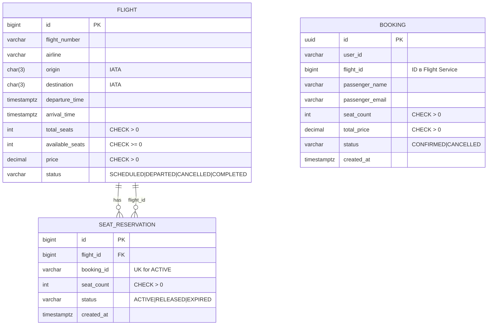

# ER-диаграмма (3NF)

## Flight Service

- **Flight** — рейс. Комбинация (flight_number, departure_date) уникальна.
- **SeatReservation** — резервация мест на рейсе. Одна запись на одно бронирование (booking_id уникален среди активных).

## Booking Service

- **Booking** — бронирование. Ссылка на flight_id (внешний ID в Flight Service), данные пассажира, цена на момент бронирования.

## Mermaid

## Ограничения целостности

| Сущность   | Ограничение |
|-----------|-------------|
| Flight    | total_seats > 0, available_seats >= 0, price > 0, status IN (...). UNIQUE(flight_number, DATE(departure_time)) |
| SeatReservation | seat_count > 0, status IN (ACTIVE, RELEASED, EXPIRED). Один ACTIVE на booking_id. flight_id → Flight(id) |
| Booking   | seat_count > 0, total_price > 0, status IN (CONFIRMED, CANCELLED) |

## 3NF

- Нет повторяющихся групп (списков в ячейке).
- Все неключевые атрибуты зависят только от первичного ключа.
- Нет транзитивных зависимостей: airline мог бы быть в отдельной таблице Airlines, но при требовании «рейс содержит информацию об авиакомпании» храним airline в Flight как достаточный минимум для 3NF (название компании напрямую зависит от flight).
